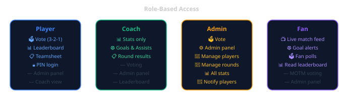

# Keysborough District FC — MOTM Voting App

> Man of the Match voting, stats, and live match feed for Keysborough District Football Club.

<p align="center">
  
  
  
  
</p>

**Live app:** https://keysborough-district-motm.web.app  
**Fan Zone:** https://fans.keysborough-district-motm.web.app

---

A mobile-first PWA for KDFC players, coaches, admins, and fans. Players vote 3-2-1 for Man of the Match after each game. Coaches track goals and assists. Admins manage rounds, teamsheets, and player lists. Fans follow live match events, goal alerts, and polls.

---

## Roles

<p align="center">
  
</p>

---

## Features

### Voting
- 3-2-1 MOTM points system per team per round
- Vote unlocks 90 minutes after kick-off
- Submitted votes viewable (read-only) after submission
- Vote reminder push notifications

### Leaderboard
- Votes, Goals, and Assists tabs
- Round filter or season totals
- "Up to week X" slider for season view
- Seniors displayed above Reserves

### Admin Panel
- Create and manage rounds (date, kick-off time, opponent, venue)
- Assign teamsheets per round per team
- Enter goals, assists, and results
- Manage player list — add, edit, assign roles, reset PINs
- One-tap "Notify players to vote" button

### Fan Zone (separate PWA)
- Live match feed — kick-off, goals, half time, full time
- Goal notifications (push) with score
- Fan polls during the match
- Fan MOTM vote
- Match predictions

### Auth
- PIN-based — 4-digit PIN, no email or password
- Works offline (PWA service worker cache)
- Installable on iOS and Android home screens

---

## Tech Stack

| Layer | Technology |
|---|---|
| Framework | Next.js 14 (App Router, static export) |
| Styling | Tailwind CSS |
| Database | Firebase Firestore |
| Hosting | Firebase Hosting (CDN, zero server cost) |
| Auth | PIN-based (localStorage) |
| Notifications | Web Push API + VAPID + Cloud Functions |
| Functions | Firebase Cloud Functions (Node 22, australia-southeast1) |
| Language | TypeScript |

---

## Project Structure

```
src/
  app/
    page.tsx              # Home (votes + stats tabs)
    login/                # PIN login
    vote/[roundId]/       # Cast or view votes
    admin/                # Admin panel tabs
    fan-guide/            # Fan Zone onboarding
  components/
    Header.tsx
    VoteTile.tsx
    Toast.tsx
  lib/
    firebase.ts           # Firestore init (via env vars)
    auth.ts               # PIN auth helpers
    types.ts              # TypeScript interfaces
    push.ts               # Push subscription management
fans-app/                 # Separate Fan Zone PWA
  src/app/
    page.tsx              # Live match feed
    vote/                 # Fan MOTM vote
    predict/              # Match prediction
functions/
  index.js                # Cloud Functions:
                          #   sendVoteReminders (scheduled)
                          #   verifyPin (callable — custom auth token)
                          #   onGoalLogged / onGoalDeleted (push triggers)
firestore.rules           # Security rules
```

---

## Development

```bash
npm install
cp .env.local.example .env.local   # fill in Firebase config
npm run dev                         # localhost:3000
npm run build                       # static export → out/
```

## Deployment

```bash
firebase deploy --only hosting          # deploy app
firebase deploy --only firestore:rules  # deploy security rules
firebase deploy --only functions        # deploy Cloud Functions
```

---

## Security Notes

- Firebase API key restricted to app domain
- PIN verification via `verifyPin` Cloud Function returns a Firebase custom token (in progress — `feature/secure-pin-auth`)
- Admin/superadmin roles set via Firebase console only — never writable by the app
- Vote document IDs scoped per player per team per round

---

> ⚠️ **Production app** — in active use by the club. Do not modify `main` without testing on `feature/*` branches first.
